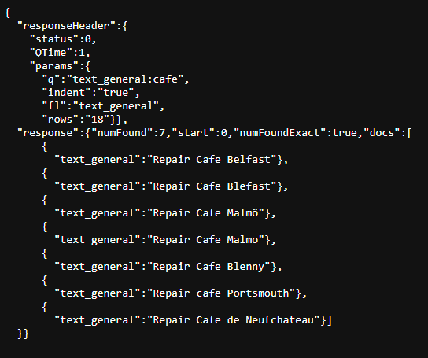
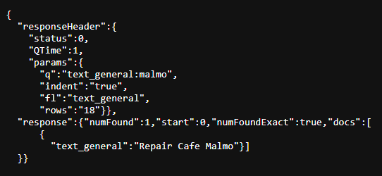
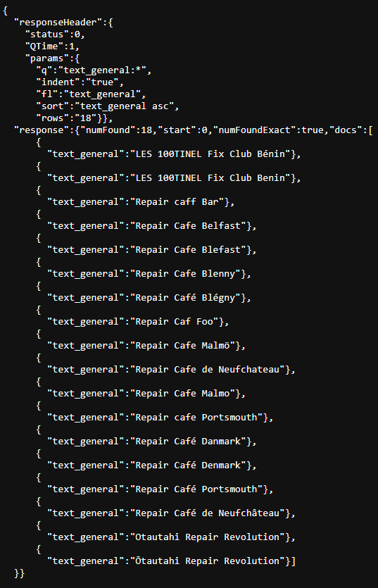
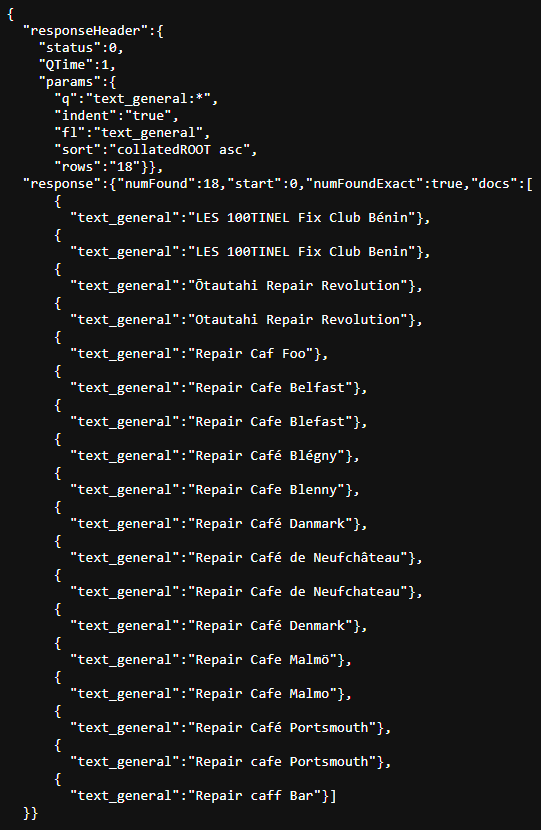
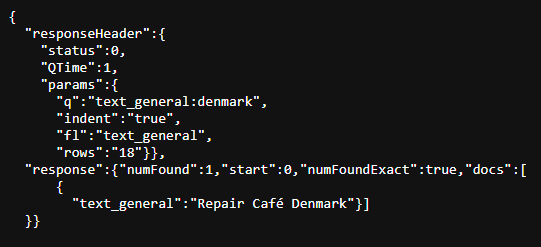
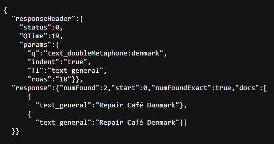
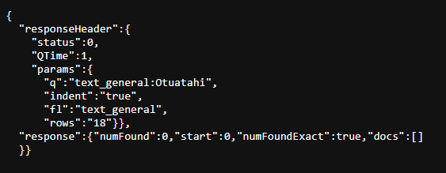
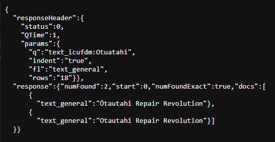

# APACHE SOLR TEST DATA

For use with Solr cores nested under the "test" folder.

## test_lang.csv

Set of real and fake `group_identifier` strings for testing international characters and phonetic matching.

### Filter accents

#### Groups with any variation of the word "cafe", i.e. "Café", "café", "Cafe"

Not phonetic, exact spelling, case-insensitive.

Query with a vanilla `text_general` field

`http://localhost:8983/solr/test_lang/select?indent=true&rows=18&fl=text_general&q=text_general:cafe`

Query with an [ICU](https://unicode-org.github.io/icu/userguide/icu4j/why-use-icu4j.html) field type

`http://localhost:8983/solr/test_lang/select?indent=true&rows=18&fl=text_general&q=text_icuFolding:cafe`

#### Look for a repair cafe in "Malmö"

Not phonetic, exact spelling, case-insensitive.

Query with a vanilla `text_general` field

`http://localhost:8983/solr/test_lang/select?indent=true&rows=18&fl=text_general&q=text_general:malmo`

Query with an [ICU](https://unicode-org.github.io/icu/userguide/icu4j/why-use-icu4j.html) field type

`http://localhost:8983/solr/test_lang/select?indent=true&rows=18&fl=text_general&q=text_icuFolding:malmo`

## Sorting strings with international characters

With no sort order.

`http://localhost:8983/solr/test_lang/select?indent=true&fl=text_general&q=text_general:*&rows=18`

Sorted on a vanilla `text_general` field

`http://localhost:8983/solr/test_lang/select?indent=true&fl=text_general&q=text_general:*&rows=18&sort=text_general asc`

Sorted on an [ICU collation](https://solr.apache.org/docs/9_0_0/modules/analysis-extras/org/apache/solr/schema/ICUCollationField.html) field type.

`http://localhost:8983/solr/test_lang/select?indent=true&fl=text_general&q=text_general:*&rows=18&sort=collatedROOT asc`

### Phonetic matching

Look for groups in Denmark, which can be listed as Danmark.

#### Query with a vanilla `text_general` field

`http://localhost:8983/solr/test_lang/select?indent=true&rows=18&fl=text_general&q=text_general:denmark`

#### Query with a Double Metaphone field

`http://localhost:8983/solr/test_lang/select?indent=true&rows=18&fl=text_general&q=text_doubleMetaphone:denmark`

#### Query with a Beider Morse field

To Do: not working properly?

`http://localhost:8983/solr/test_lang/select?indent=true&rows=18&fl=text_general&q=text_BeiderMorse:denmark`

### Combined accent filter and phonetic match

Look for group "Ōtautahi Repair Revolution" using a miss-spelling that involves both a wrong character and wrong character order.

Query with a vanilla `text_general field.

`http://localhost:8983/solr/test_lang/select?indent=true&rows=18&fl=text_general&q=text_general:Otuatahi`

Query with a field indexed using both Double Metaphone phonetic algorithm and an [ICU](https://unicode-org.github.io/icu/userguide/icu4j/why-use-icu4j.html) filter

`http://localhost:8983/solr/test_lang/select?indent=true&rows=18&fl=text_general&q=text_icufdm:Otuatahi`

## Links

[The Missing Guide to the ICU Message Format](https://phrase.com/blog/posts/guide-to-the-icu-message-format/)
[Class ICUCollationField](https://solr.apache.org/docs/9_0_0/modules/analysis-extras/org/apache/solr/schema/ICUCollationField.html)
[Phonetic Matching](https://solr.apache.org/guide/solr/9_1/indexing-guide/phonetic-matching.html)
[Phonetic Matching with Apache Solr - Slideshare](https://www.slideshare.net/MarkusGnther9/phonetic-matching-with-apache-solr)
[Understanding phonetic matching](https://subscription.packtpub.com/book/data/9781788837385/4/ch04lvl1sec33/understanding-phonetic-matching)
