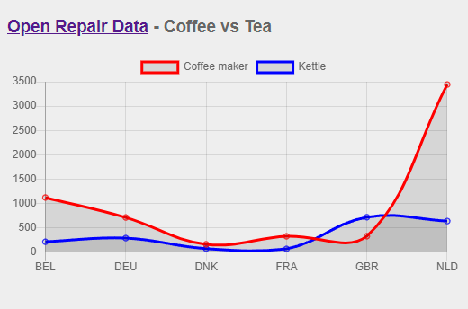

# Data visualisation

An example using SQL, Python, JSON, ChartJS and HTML.

## Javascript

[ChartJS](https://www.chartjs.org/)

[Data-Driven Documents (D3)](https://d3js.org/)

[Plotly](https://plotly.com/javascript/)
